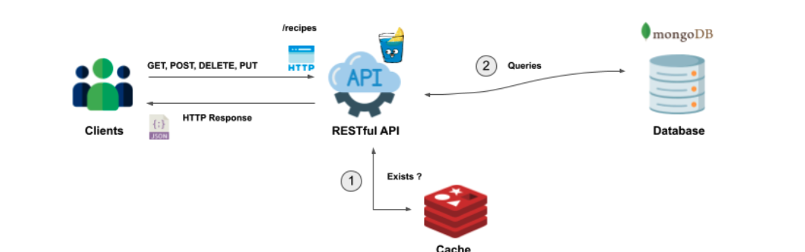

docker run -d --name mongodb -e MONGO_INITDB_ROOT_USERNAME=admin -e MONGO_INITDB_ROOT_PASSWORD=password -p 27017:27017 mongo:latest
docker run -d --name redis -p 6379:6379 redis:6.0
docker run -d --name redisinsight --link redis -p 8001:8001 redislabs/redisinsight
mongoimport --username admin --password password --authenticationDatabase admin --db demo --collection recipes --file recipes.json --jsonArray
